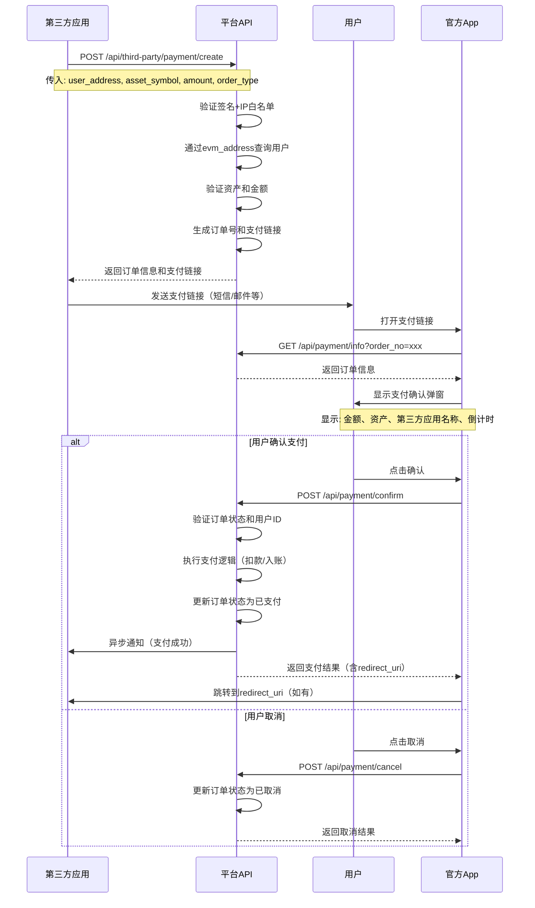

# TokenTalk 第三方支付订单 API 文档

TokenTalk 平台为第三方开发者提供**补偿充提订单**功能，允许第三方应用通过用户的钱包地址（evm_address）生成支付订单，用户在官方App中确认支付后完成充值或提现操作。

## 📋 目录

- [快速开始](#快速开始)
- [业务概述](#业务概述)
- [与现有充提方案的区别](#与现有充提方案的区别)
- [完整业务流程](#完整业务流程)
- [API 接口文档](#api-接口文档)
- [安全机制](#安全机制)
- [SDK 示例](#sdk-示例)
- [常见问题](#常见问题)

## 🚀 快速开始

### 1. 前置条件

- 已完成第三方应用申请，获得 `app_key` 和 `app_secret`
- 用户已注册 TokenTalk 平台账户，并绑定钱包地址（evm_address）

### 2. 核心特点

- ✅ **无需用户授权**：通过 `evm_address` 识别用户，无需提前授权
- ✅ **订单模式**：生成订单后，用户确认支付，支持取消和过期
- ✅ **时效控制**：订单5分钟有效期，超时自动失效
- ✅ **安全可靠**：订单号由平台生成，防止第三方篡改
- ✅ **幂等设计**：支持订单重复创建和支付确认幂等

### 3. 业务流程概述

```
┌────────────────────────────────────────────────────────────────────────────┐
│                        第三方支付订单业务流程                                 │
├────────────────────────────────────────────────────────────────────────────┤
│                                                                            │
│  ┌──────────────┐      ┌──────────────┐      ┌──────────────┐              │
│  │  1.第三方     │  →   │  2.平台生成   │  →   │  3.返回支付   │              │
│  │  创建订单     │      │  订单和链接   │      │  链接         │              │
│  └──────────────┘      └──────────────┘      └──────────────┘              │
│                                                                            │
│                                                      ↓                     │
│                                                                            │
│  ┌──────────────┐      ┌──────────────┐      ┌──────────────┐              │
│  │  4.用户打开   │  →   │  5.App查询    │  →   │  6.显示支付   │             │
│  │  支付链接     │      │  订单信息     │      │  确认弹窗     │             │
│  └──────────────┘      └──────────────┘      └──────────────┘              │
│                                                                            │
│                                                      ↓                     │
│                                                                            │
│                              ┌──────────────────────────┐                  │
│                              │  7.用户确认支付/取消订单   │                  │
│                              │  8.平台处理支付并通知第三方 │                  │
│                              └──────────────────────────┘                  │
│                                                                            │
└────────────────────────────────────────────────────────────────────────────┘
```

## 📖 业务概述

### 业务场景

支付订单功能适用于以下场景：

1. **场景1：第三方向用户收费**
   - 第三方应用需要向用户收取费用
   - 生成订单后，用户通过App支付

2. **场景2：第三方补偿用户**
   - 第三方应用需要补偿用户资产
   - 用户确认后完成充值

3. **场景3：第三方发起充值请求**
   - 第三方应用发起充值请求
   - 用户确认后完成充值

### 订单类型

| 订单类型 | 说明 | 资金流向 |
|---------|------|---------|
| `deposit` | 充值订单 | 用户账户 → 第三方账户（用户支付给第三方） |
| `withdraw` | 提现订单 | 第三方账户 → 用户账户（第三方支付给用户） |

### 订单状态

| 状态 | 值 | 说明 |
|------|-----|------|
| `pending` | 0 | 待支付（订单创建后，等待用户支付） |
| `paid` | 1 | 已支付（用户确认支付，订单完成） |
| `cancelled` | 2 | 已取消（用户主动取消订单） |
| `expired` | 3 | 已过期（订单超过5分钟未支付，自动过期） |

## 🔄 与现有充提方案的区别

| 特性 | 现有充提方案 | 支付订单方案 |
|------|------------|------------|
| **用户识别方式** | `authorization_token` | `evm_address` |
| **支付方式** | 直接内部转账 | 生成订单，用户确认后支付 |
| **用户操作** | 需要先授权 | 直接通过地址识别 |
| **订单状态** | 立即处理 | 待支付→已支付/已取消/已过期 |
| **订单有效期** | 无 | 5分钟 |
| **适用场景** | 已授权用户充提 | 未授权用户支付订单 |

## 🔄 完整业务流程

### 流程图



### 详细步骤说明

#### 步骤1：第三方创建订单

第三方应用调用创建订单接口，传入用户钱包地址、资产符号、金额等信息。

**请求示例**：
```json
POST /api/third-party/payment/create
{
  "third_party_order_no": "PAY2026010312345678",
  "user_address": "0x1234567890123456789012345678901234567890",
  "asset_symbol": "USDT",
  "amount": "100.000000",
  "order_type": "deposit",
  "memo": "订单备注信息",
  "redirect_uri": "https://third-party.com/callback"
}
```

**响应示例**：
```json
{
  "code": 0,
  "message": "success",
  "data": {
    "order_no": "TPP2026010312345678",
    "third_party_order_no": "PAY2026010312345678",
    "user_address": "0x1234567890123456789012345678901234567890",
    "user_id": 10001,
    "asset_symbol": "USDT",
    "amount": "100.000000",
    "order_type": "deposit",
    "status": "pending",
    "payment_link": "https://openapi.tokentalk.cc/payment/TPP2026010312345678",
    "expires_at": "2026-01-03T10:05:00Z",
    "create_time": "2026-01-03T10:00:00Z"
  }
}
```

#### 步骤2：第三方发送支付链接给用户

第三方应用将 `payment_link` 发送给用户（通过短信、邮件、站内消息等）。

**支付链接格式**：
```
https://openapi.tokentalk.cc/payment/{order_no}
```

**安全说明**：
- 支付链接中只包含订单号，不包含订单金额等敏感信息
- App端通过订单号查询订单信息，确保获取的是平台数据库中的真实数据
- 防止第三方篡改支付链接中的订单信息

#### 步骤3：用户打开支付链接

用户在官方App中打开支付链接，App检测到支付链接后：

1. 从URL中提取 `order_no`（订单号）
2. 调用 `GET /api/payment/info?order_no={order_no}` 获取订单信息
3. 显示支付确认弹窗

#### 步骤4：用户确认或取消

**用户确认支付**：
- 用户点击确认按钮
- App调用 `POST /api/payment/confirm`，传入订单号
- 平台验证订单状态、用户ID、余额等
- 执行支付逻辑（根据订单类型扣款/入账）
- 更新订单状态为已支付
- 触发异步通知给第三方
- 返回支付结果，如果订单有 `redirect_uri`，响应中包含跳转地址

**用户取消订单**：
- 用户点击取消按钮
- App调用 `POST /api/payment/cancel`，传入订单号
- 平台更新订单状态为已取消
- 返回取消结果

## 📡 API 接口文档

### 鉴权说明

所有第三方接口都需要使用**应用签名鉴权**，参考主文档的[鉴权说明](#鉴权说明)。

### 1. 创建支付订单

**接口**: `POST /api/third-party/payment/create`

**说明**: 第三方调用此接口创建支付订单，平台返回支付链接。

**请求体**:
```json
{
  "third_party_order_no": "PAY2026010312345678",
  "user_address": "0x1234567890123456789012345678901234567890",
  "asset_symbol": "USDT",
  "amount": "100.000000",
  "order_type": "deposit",
  "redirect_uri": "https://third-party.com/callback",
  "memo": "订单备注信息",
  "metadata": {
    "custom_field": "custom_value"
  }
}
```

**参数说明**:

| 参数 | 类型 | 必需 | 说明 |
|------|------|------|------|
| `third_party_order_no` | string | 是 | 第三方订单号（用于幂等性控制，必须唯一） |
| `user_address` | string | 是 | 用户钱包地址（evm_address格式，42字符） |
| `asset_symbol` | string | 是 | 资产符号，如 `USDT`、`USDC` |
| `amount` | string | 是 | 订单金额，精度最多18位小数 |
| `order_type` | string | 是 | 订单类型：`deposit`（充值）或 `withdraw`（提现） |
| `redirect_uri` | string | 否 | 第三方回调地址（可选，支付成功后跳转，如果未传则使用 `third_party_apps.callback_url`） |
| `memo` | string | 否 | 订单备注信息 |
| `metadata` | object | 否 | 扩展信息（JSON对象） |

**响应示例**:
```json
{
  "code": 0,
  "message": "success",
  "data": {
    "order_no": "TPP2026010312345678",
    "third_party_order_no": "PAY2026010312345678",
    "user_address": "0x1234567890123456789012345678901234567890",
    "user_id": 10001,
    "asset_symbol": "USDT",
    "amount": "100.000000",
    "order_type": "deposit",
    "status": "pending",
    "payment_link": "https://openapi.tokentalk.cc/payment/TPP2026010312345678",
    "expires_at": "2026-01-03T10:05:00Z",
    "create_time": "2026-01-03T10:00:00Z"
  }
}
```

**业务逻辑**:
1. 验证第三方应用签名和权限
2. 通过 `user_address` 查询用户，获取 `user_id`
3. 验证用户状态（必须是正常用户）
4. 验证资产是否存在且在 `funding_assets` 表中
5. 验证资产是否支持当前场景（deposit/withdraw）
6. 生成订单号 `order_no`（格式：TPP + 时间戳 + 随机数）
7. 处理 `redirect_uri`（优先使用请求中的值，否则使用应用配置的 `callback_url`）
8. 生成支付链接：`https://openapi.tokentalk.cc/payment/{order_no}`
9. 设置订单过期时间：`expires_at = create_time + 5分钟`
10. 保存订单到数据库
11. 返回订单信息和支付链接

**错误响应**:
```json
{
  "code": 10001,
  "message": "user not found"
}
```

```json
{
  "code": 10002,
  "message": "duplicate order",
  "data": {
    "order_no": "TPP2026010312345678"
  }
}
```

### 2. 查询支付订单状态

**接口**: `GET /api/third-party/payment/query`

**说明**: 第三方查询订单状态。

**参数**:
- `third_party_order_no` (必需): 第三方订单号

**响应示例**:
```json
{
  "code": 0,
  "message": "success",
  "data": {
    "order_no": "TPP2026010312345678",
    "third_party_order_no": "PAY2026010312345678",
    "user_address": "0x1234567890123456789012345678901234567890",
    "user_id": 10001,
    "asset_symbol": "USDT",
    "amount": "100.000000",
    "order_type": "deposit",
    "status": "paid",
    "payment_link": "https://openapi.tokentalk.cc/payment/TPP2026010312345678",
    "expires_at": "2026-01-03T10:05:00Z",
    "paid_at": "2026-01-03T10:02:00Z",
    "create_time": "2026-01-03T10:00:00Z",
    "update_time": "2026-01-03T10:02:00Z"
  }
}
```

### 3. 获取订单信息（App端）

**接口**: `GET /api/payment/info`

**说明**: App通过订单号查询订单信息，用于显示支付确认弹窗。**无需认证**。

**参数**:
- `order_no` (必需): 订单号

**响应示例**:
```json
{
  "code": 0,
  "message": "success",
  "data": {
    "order_no": "TPP2026010312345678",
    "third_party_order_no": "PAY2026010312345678",
    "app_id": "app_1234567890",
    "app_name": "第三方应用名称",
    "user_address": "0x1234567890123456789012345678901234567890",
    "asset_symbol": "USDT",
    "amount": "100.000000",
    "order_type": "deposit",
    "status": "pending",
    "memo": "订单备注信息",
    "expires_at": "2026-01-03T10:05:00Z",
    "create_time": "2026-01-03T10:00:00Z",
    "remaining_seconds": 300
  }
}
```

**业务逻辑**:
1. 通过 `order_no` 查询订单（订单号由平台生成，无法被第三方篡改）
2. 验证订单是否过期（如果过期，返回过期状态）
3. 查询第三方应用信息（app_name）
4. 计算剩余有效时间（remaining_seconds）
5. 返回订单信息（不包含敏感信息）

### 4. 用户确认支付（App端）

**接口**: `POST /api/payment/confirm`

**说明**: 用户在App中确认支付，完成订单。**需要用户认证（JWT Token）**。

**请求体**:
```json
{
  "order_no": "TPP2026010312345678"
}
```

**响应示例**:
```json
{
  "code": 0,
  "message": "success",
  "data": {
    "order_no": "TPP2026010312345678",
    "status": "paid",
    "paid_at": "2026-01-03T10:02:00Z",
    "redirect_uri": "https://third-party.com/callback?order_no=TPP2026010312345678&status=paid"
  }
}
```

**说明**:
- 如果订单有 `redirect_uri`，响应中会包含 `redirect_uri` 字段，App端可以跳转到该地址
- 如果没有 `redirect_uri`，则不返回该字段

**业务逻辑**:
1. 验证用户Token
2. 通过 `order_no` 查询订单（订单号由平台生成，无法被第三方篡改）
3. 验证订单状态（必须是待支付状态）
4. 验证订单是否过期
5. 验证订单用户ID与当前用户ID是否匹配
6. 根据 `order_type` 执行不同的支付逻辑：
   - `deposit`：用户账户扣款 → 第三方账户入账
   - `withdraw`：第三方账户扣款 → 用户账户入账
7. 更新订单状态为已支付
8. 记录账户流水
9. 触发异步通知（优先使用订单的 `redirect_uri`，如果没有则使用 `third_party_apps.callback_url`）
10. 返回支付结果，如果订单有 `redirect_uri`，响应中包含跳转地址

**错误响应**:
```json
{
  "code": 20001,
  "message": "order not found"
}
```

```json
{
  "code": 20002,
  "message": "order expired"
}
```

```json
{
  "code": 20003,
  "message": "insufficient balance"
}
```

### 5. 用户取消订单（App端）

**接口**: `POST /api/payment/cancel`

**说明**: 用户在App中取消订单。**需要用户认证（JWT Token）**。

**请求体**:
```json
{
  "order_no": "TPP2026010312345678"
}
```

**响应示例**:
```json
{
  "code": 0,
  "message": "success",
  "data": {
    "order_no": "TPP2026010312345678",
    "status": "cancelled",
    "cancelled_at": "2026-01-03T10:01:00Z"
  }
}
```

**业务逻辑**:
1. 验证用户Token
2. 通过 `order_no` 查询订单
3. 验证订单状态（必须是待支付状态）
4. 验证订单用户ID与当前用户ID是否匹配
5. 更新订单状态为已取消
6. 记录取消时间
7. 返回取消结果

## 🔐 安全机制

### 1. 订单号安全机制

1. **订单号生成**：
   - 订单号由平台生成，格式：`TPP + 时间戳 + 随机数`
   - 存储在数据库中，建立唯一索引
   - 第三方无法篡改订单号

2. **订单信息查询安全**：
   - App端通过订单号查询订单信息，而不是通过支付链接中的参数
   - 订单号由平台生成，第三方无法篡改
   - 支付链接中只包含订单号，不包含订单金额等敏感信息
   - 防止第三方篡改支付链接中的订单信息

3. **订单验证**：
   - 支付确认时通过订单号查询订单
   - 验证订单状态（必须是待支付）
   - 验证订单是否过期
   - 验证用户ID匹配（防止他人支付）

### 2. 用户身份验证

1. **地址验证**：
   - 创建订单时通过 `evm_address` 查询用户
   - 验证用户状态（status = 1，正常用户）
   - 如果用户不存在或状态异常，拒绝创建订单

2. **支付验证**：
   - 支付确认时验证当前登录用户ID与订单用户ID匹配
   - 防止他人使用支付链接支付

### 3. 余额校验

1. **deposit订单**（用户支付给第三方）：
   - 支付前校验用户账户余额是否充足
   - 余额不足，拒绝支付

2. **withdraw订单**（第三方支付给用户）：
   - 支付前校验第三方账户余额是否充足
   - 余额不足，拒绝支付

### 4. 幂等性控制

1. **订单创建幂等**：
   - 使用 `app_id + third_party_order_no` 唯一索引
   - 重复创建返回已有订单信息

2. **支付确认幂等**：
   - 支付前检查订单状态
   - 如果已支付，直接返回成功（不重复扣款）

## 💻 SDK 示例

### Go SDK

```go
package main

import (
    "bytes"
    "crypto/sha256"
    "encoding/hex"
    "encoding/json"
    "fmt"
    "io"
    "net/http"
    "sort"
    "strings"
    "time"
)

type PaymentClient struct {
    AppID     string
    AppKey    string
    AppSecret string
    BaseURL   string
    Client    *http.Client
}

func NewPaymentClient(appID, appKey, appSecret, baseURL string) *PaymentClient {
    return &PaymentClient{
        AppID:     appID,
        AppKey:    appKey,
        AppSecret: appSecret,
        BaseURL:   baseURL,
        Client:    &http.Client{Timeout: 30 * time.Second},
    }
}

func (c *PaymentClient) generateSignature(params map[string]string) string {
    params["key"] = c.AppKey
    params["secret"] = c.AppSecret
    
    keys := make([]string, 0, len(params))
    for k := range params {
        keys = append(keys, k)
    }
    sort.Strings(keys)
    
    var buf strings.Builder
    for i, k := range keys {
        if i > 0 {
            buf.WriteString("&")
        }
        buf.WriteString(k)
        buf.WriteString("=")
        buf.WriteString(params[k])
    }
    
    h := sha256.New()
    h.Write([]byte(buf.String()))
    return hex.EncodeToString(h.Sum(nil))
}

func (c *PaymentClient) Request(method, path string, body interface{}) (*http.Response, error) {
    url := c.BaseURL + path
    
    var bodyReader io.Reader
    params := make(map[string]string)
    
    if body != nil {
        bodyBytes, _ := json.Marshal(body)
        bodyReader = bytes.NewReader(bodyBytes)
        params["body"] = string(bodyBytes)
    }
    
    timestamp := fmt.Sprintf("%d", time.Now().UnixMilli())
    nonce := fmt.Sprintf("%d", time.Now().UnixNano())
    
    params["timestamp"] = timestamp
    params["nonce"] = nonce
    
    signature := c.generateSignature(params)
    
    req, _ := http.NewRequest(method, url, bodyReader)
    req.Header.Set("Content-Type", "application/json")
    req.Header.Set("X-App-Key", c.AppKey)
    req.Header.Set("X-Signature", signature)
    req.Header.Set("X-Timestamp", timestamp)
    req.Header.Set("X-Nonce", nonce)
    
    return c.Client.Do(req)
}

// CreatePaymentOrder 创建支付订单
func (c *PaymentClient) CreatePaymentOrder(req CreatePaymentOrderRequest) (*PaymentOrderResponse, error) {
    resp, err := c.Request("POST", "/api/third-party/payment/create", req)
    if err != nil {
        return nil, err
    }
    defer resp.Body.Close()
    
    var result struct {
        Code    int                   `json:"code"`
        Message string                `json:"message"`
        Data    PaymentOrderResponse  `json:"data"`
    }
    
    if err := json.NewDecoder(resp.Body).Decode(&result); err != nil {
        return nil, err
    }
    
    if result.Code != 0 {
        return nil, fmt.Errorf("error: %s", result.Message)
    }
    
    return &result.Data, nil
}

// QueryPaymentOrder 查询支付订单状态
func (c *PaymentClient) QueryPaymentOrder(thirdPartyOrderNo string) (*PaymentOrderResponse, error) {
    url := fmt.Sprintf("%s/api/third-party/payment/query?third_party_order_no=%s", c.BaseURL, thirdPartyOrderNo)
    
    params := make(map[string]string)
    params["third_party_order_no"] = thirdPartyOrderNo
    
    timestamp := fmt.Sprintf("%d", time.Now().UnixMilli())
    nonce := fmt.Sprintf("%d", time.Now().UnixNano())
    
    params["timestamp"] = timestamp
    params["nonce"] = nonce
    
    signature := c.generateSignature(params)
    
    req, _ := http.NewRequest("GET", url, nil)
    req.Header.Set("X-App-Key", c.AppKey)
    req.Header.Set("X-Signature", signature)
    req.Header.Set("X-Timestamp", timestamp)
    req.Header.Set("X-Nonce", nonce)
    
    resp, err := c.Client.Do(req)
    if err != nil {
        return nil, err
    }
    defer resp.Body.Close()
    
    var result struct {
        Code    int                   `json:"code"`
        Message string                `json:"message"`
        Data    PaymentOrderResponse  `json:"data"`
    }
    
    if err := json.NewDecoder(resp.Body).Decode(&result); err != nil {
        return nil, err
    }
    
    if result.Code != 0 {
        return nil, fmt.Errorf("error: %s", result.Message)
    }
    
    return &result.Data, nil
}

type CreatePaymentOrderRequest struct {
    ThirdPartyOrderNo string                 `json:"third_party_order_no"`
    UserAddress       string                 `json:"user_address"`
    AssetSymbol       string                 `json:"asset_symbol"`
    Amount            string                 `json:"amount"`
    OrderType         string                 `json:"order_type"`
    RedirectURI       string                 `json:"redirect_uri,omitempty"`
    Memo              string                 `json:"memo,omitempty"`
    Metadata          map[string]interface{} `json:"metadata,omitempty"`
}

type PaymentOrderResponse struct {
    OrderNo           string `json:"order_no"`
    ThirdPartyOrderNo string `json:"third_party_order_no"`
    UserAddress       string `json:"user_address"`
    UserID            uint64 `json:"user_id"`
    AssetSymbol       string `json:"asset_symbol"`
    Amount            string `json:"amount"`
    OrderType         string `json:"order_type"`
    Status            string `json:"status"`
    PaymentLink       string `json:"payment_link"`
    ExpiresAt         string `json:"expires_at"`
    CreateTime        string `json:"create_time"`
}

func main() {
    client := NewPaymentClient(
        "app_1234567890",
        "ak_your_app_key",
        "sk_your_app_secret",
        "https://openapi.tokentalk.cc",
    )
    
    // 创建支付订单
    resp, err := client.CreatePaymentOrder(CreatePaymentOrderRequest{
        ThirdPartyOrderNo: "PAY2026010312345678",
        UserAddress:       "0x1234567890123456789012345678901234567890",
        AssetSymbol:       "USDT",
        Amount:            "100.000000",
        OrderType:         "deposit",
        Memo:              "用户支付订单",
        RedirectURI:       "https://third-party.com/callback",
    })
    
    if err != nil {
        fmt.Printf("创建订单失败: %v\n", err)
        return
    }
    
    fmt.Printf("订单号: %s\n", resp.OrderNo)
    fmt.Printf("支付链接: %s\n", resp.PaymentLink)
    
    // 发送支付链接给用户（通过短信、邮件等）
    // ...
    
    // 查询订单状态
    order, err := client.QueryPaymentOrder("PAY2026010312345678")
    if err != nil {
        fmt.Printf("查询订单失败: %v\n", err)
        return
    }
    
    fmt.Printf("订单状态: %s\n", order.Status)
}
```

### Python SDK

```python
import hashlib
import json
import time
import requests
from typing import Dict, Optional

class PaymentClient:
    def __init__(self, app_id: str, app_key: str, app_secret: str, 
                 base_url: str = "https://openapi.tokentalk.cc"):
        self.app_id = app_id
        self.app_key = app_key
        self.app_secret = app_secret
        self.base_url = base_url
    
    def _generate_signature(self, params: Dict[str, str]) -> str:
        params["key"] = self.app_key
        params["secret"] = self.app_secret
        
        sorted_keys = sorted(params.keys())
        query_string = "&".join([f"{k}={params[k]}" for k in sorted_keys])
        
        return hashlib.sha256(query_string.encode()).hexdigest()
    
    def _request(self, method: str, path: str, body: Optional[Dict] = None) -> Dict:
        url = f"{self.base_url}{path}"
        params = {}
        
        if body:
            params["body"] = json.dumps(body)
        
        timestamp = str(int(time.time() * 1000))
        nonce = str(int(time.time() * 1000000))
        
        params["timestamp"] = timestamp
        params["nonce"] = nonce
        
        signature = self._generate_signature(params)
        
        headers = {
            "Content-Type": "application/json",
            "X-App-Key": self.app_key,
            "X-Signature": signature,
            "X-Timestamp": timestamp,
            "X-Nonce": nonce,
        }
        
        if method == "GET":
            resp = requests.get(url, headers=headers, params=body)
        else:
            resp = requests.post(url, headers=headers, json=body)
        
        resp.raise_for_status()
        return resp.json()
    
    def create_payment_order(self, third_party_order_no: str, user_address: str,
                            asset_symbol: str, amount: str, order_type: str,
                            redirect_uri: str = "", memo: str = "") -> Dict:
        """创建支付订单"""
        return self._request("POST", "/api/third-party/payment/create", {
            "third_party_order_no": third_party_order_no,
            "user_address": user_address,
            "asset_symbol": asset_symbol,
            "amount": amount,
            "order_type": order_type,
            "redirect_uri": redirect_uri,
            "memo": memo,
        })
    
    def query_payment_order(self, third_party_order_no: str) -> Dict:
        """查询支付订单状态"""
        return self._request("GET", "/api/third-party/payment/query", {
            "third_party_order_no": third_party_order_no,
        })

# 使用示例
client = PaymentClient(
    app_id="app_1234567890",
    app_key="ak_your_app_key",
    app_secret="sk_your_app_secret"
)

# 创建支付订单
result = client.create_payment_order(
    third_party_order_no="PAY2026010312345678",
    user_address="0x1234567890123456789012345678901234567890",
    asset_symbol="USDT",
    amount="100.000000",
    order_type="deposit",
    memo="用户支付订单",
    redirect_uri="https://third-party.com/callback"
)

print(f"订单号: {result['data']['order_no']}")
print(f"支付链接: {result['data']['payment_link']}")

# 发送支付链接给用户（通过短信、邮件等）
# ...

# 查询订单状态
order = client.query_payment_order("PAY2026010312345678")
print(f"订单状态: {order['data']['status']}")
```

## ❓ 常见问题

### Q1: 用户如何知道有订单需要支付？

**A**: 第三方应用生成订单后，将支付链接发送给用户（通过短信、邮件、站内消息等），用户点击链接后在App中确认支付。

### Q2: 订单过期后还能支付吗？

**A**: 不能。订单过期后状态变为已过期，无法继续支付。第三方需要重新创建订单。

### Q3: 用户可以取消订单吗？

**A**: 可以。用户在支付确认弹窗中点击取消，订单状态变为已取消。

### Q4: 订单取消后还能继续支付吗？

**A**: 不能。订单取消后无法继续支付。第三方需要重新创建订单。

### Q5: 如何防止重复支付？

**A**: 
1. 支付前检查订单状态（必须是待支付）
2. 使用数据库事务保证原子性
3. 支付成功后立即更新订单状态
4. 已支付的订单再次确认会直接返回成功（幂等）

### Q6: 如果用户余额不足怎么办？

**A**: 支付时校验余额，余额不足返回错误，订单保持待支付状态。用户充值后可以继续支付（在5分钟内）。

### Q7: 订单过期时间可以配置吗？

**A**: 当前固定为5分钟。如需配置，可以在 `third_party_apps` 表中新增 `payment_order_expires_minutes` 字段。

### Q8: 支付链接可以重复使用吗？

**A**: 可以。在订单有效期内（5分钟），支付链接可以重复打开。但支付成功后，链接不再可用。

### Q9: 与现有充提方案有什么区别？

**A**: 
- **用户识别**：支付订单使用 `evm_address`，现有方案使用 `authorization_token`
- **支付方式**：支付订单需要用户确认，现有方案直接转账
- **订单状态**：支付订单有状态流转，现有方案立即处理
- **适用场景**：支付订单适用于未授权用户，现有方案适用于已授权用户

### Q10: 异步通知什么时候发送？

**A**: 
- 订单支付成功时，异步通知第三方
- 通知地址优先级：优先使用订单的 `redirect_uri`，如果没有则使用 `third_party_apps.callback_url`
- 通知包含订单详细信息，使用签名验证确保安全性

### Q11: 如何验证异步通知的签名？

**A**: 异步通知使用与API请求相同的签名算法，第三方需要验证签名确保通知来自平台。

## 📞 技术支持

- **文档**: https://github.com/tokentalk-cc/tokentalk-openapi
- **问题反馈**: https://github.com/tokentalk-cc/tokentalk-openapi/issues

## 📄 更新日志

### v1.0.0 (2026-01-07)
- 初始版本发布
- 支持支付订单创建和查询
- 支持用户确认支付和取消订单
- 支持订单信息查询（App端）
- 支持异步通知机制

## 📄 许可证

Copyright © 2026 TokenTalk. All rights reserved.

